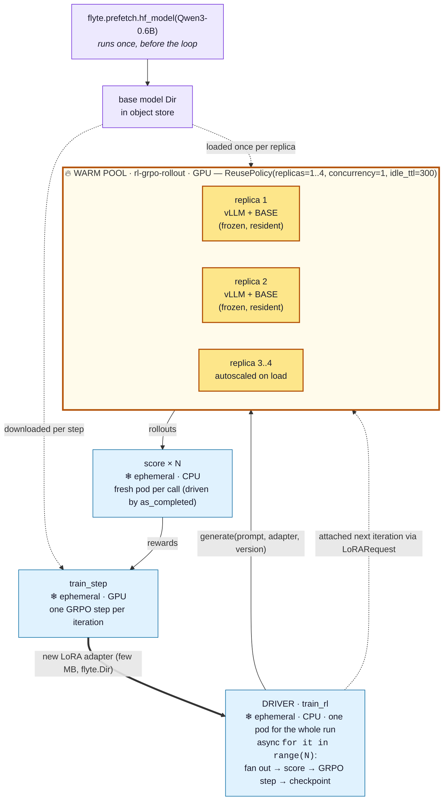

# RL (GRPO) for LLMs on Union with flyte-sdk

A reference architecture for running a **reinforcement-learning loop for LLMs (GRPO-style) natively
on Union** with `flyte-sdk` — no Ray, no external scheduler. Flyte tasks *are* the orchestrator.

The loop is the standard shape:

```
sample prompts → generate rollouts (vLLM) → score (reward) → policy update → refresh rollout adapter → repeat
```

This README is the **design doc**. A runnable example (`rl_grpo_lora.py`) will live next to it.

## Design decisions

- **No Ray** — orchestrate the loop with Flyte async tasks (`asyncio` directly).
- **vLLM** for rollout generation (already supported in `examples/genai/vllm/`).
- **Keep the inference model hot** across iterations — a reusable container (see the crux section).
- **Pipeline rollout → reward** with `asyncio.create_task` + `as_completed` (not a map barrier), so
  reward scoring overlaps in-flight rollouts.
- **LoRA by default.** The frozen base stays loaded in the warm replica; each iteration the trainer
  emits a small LoRA adapter the rollout engine attaches via vLLM's `LoRARequest`. This avoids
  in-place full-weight updates (the riskiest piece), keeps the adapter handoff tiny (a few MB), and
  shrinks the trainer to a single GPU. Full-weight RL is deferred.
- **Base model via `flyte.prefetch.hf_model`** — stream the base into Flyte object store once,
  **pre-sharded for vLLM** (`ShardConfig`/`VLLMShardArgs`), so every rollout replica and the trainer
  load it directly with no reshard and no FUSE/Volume. Faster to load into vLLM than mounting a Volume.
- **Volumes are not needed for the MVP** — prefetch covers the base, `flyte.Dir` covers the adapter.
  A Volume stays a fallback only for very large *full-weight* checkpoints.
- **Single-node trainer** for the MVP; `ClusteredTaskEnvironment` is the scale-out path.

## TL;DR — MVP vs deferred

| Concern | **MVP (build now)** | Deferred (add when needed) |
|---|---|---|
| Orchestration | async **driver task** runs the `for it in range(N)` loop (no Ray) | — |
| Hot rollout model | **reusable container** (`ReusePolicy`) — in-process vLLM `LLM`, **or** a vLLM **sidecar** via env-level `pod_template` (both work today) | App for *deployed* serving |
| Rollout fan-out + reward | `asyncio.create_task` all rollouts → `as_completed` scores each as it finishes → `gather` | autoscale `replicas=(min,max)` tuning |
| Reward | rule-based / verifiable reward in plain tasks (GRPO-style) | model-based reward = 2nd reusable vLLM env |
| Policy update | **LoRA** (PEFT) + TRL `GRPOTrainer`, single node, frozen base | full-weight update; `ClusteredTaskEnvironment`+`TorchRun` multi-node |
| Base model weights | **`flyte.prefetch.hf_model(repo=..., shard_config=...)`** → vLLM-sharded `Dir` in object store | Volume / bake into image |
| Adapter handoff trainer→rollout | tiny **LoRA adapter** as `flyte.Dir`; vLLM attaches via `LoRARequest` | full-weight `Dir` + vLLM `collective_rpc`; Volume for big full weights |
| Resume / checkpoint | `flyte.Checkpoint` on the driver loop | — |

The only genuinely new piece vs a normal training job is **keeping vLLM warm + swapping the LoRA
adapter each iteration**. Everything else is ordinary Flyte tasks.

## Architecture

```
flyte.prefetch.hf_model(repo, shard_config=vLLM) ──► base model Dir in object store (once)
     │  loaded directly by vLLM on rollout + trainer (pre-sharded, no reshard, no FUSE)
     ▼
driver task (plain async, no Ray)
┌───────────────────────────────────────────────────────────┐
│ adapter = initial_lora;  base = prefetched_model_dir       │
│ for it in range(N):                                        │
│   prompts = sample(dataset)                                │
│   # launch all rollouts at once on warm replicas          │
│   futs = [create_task(generate(base, p, adapter, it))...] ─┼─► reusable vLLM env (WARM, base prefetched)
│   # score each rollout the instant it completes           │
│   for fut in as_completed(futs):                          │
│       r = await fut;  rewards.append(create_task(score(r)))┼─► reward tasks (overlap rollouts)
│   rollouts, rewards = ..., await gather(*rewards)          │
│   adapter = await train_step(base, rollouts, rewards,     ─┼─► trainer env (1 node, LoRA/GRPO)
│                              adapter)                       │
│   await checkpoint.save(loop_state)         # → flyte.Dir  │
└───────────────────────────────────────────────────────────┘
     the LoRA adapter (a few MB) flows as a flyte.Dir output, passed by the driver
```

Three tasks across two GPU envs + a driver, plus a one-time prefetch.

### Warm-pool topology — which parts are reused vs ephemeral

Only **one** of the four environments is a warm pool: the **rollout generator**. It is the only place
where cold-start cost (loading the frozen base into a vLLM engine, ~a minute) is large relative to the
work each call does, so a `ReusePolicy` pool pays that once per replica and every iteration after just
attaches a few-MB LoRA adapter. The driver, reward, and trainer are ordinary ephemeral pods — cheap to
start, and holding no state between iterations (the trainer resumes from the adapter `Dir`).



🔥 = warm / reused across iterations (`ReusePolicy`) &nbsp;·&nbsp; ❄ = ephemeral (new container per call).
This matches what the validated cluster run showed: the `generate` actions ran as Flyte **`actor`** tasks
(the warm pool), while `init_adapter` / `score` / `train_step` ran as ordinary **`python`** pods.

### 0. Prefetch the base model (runs once, before the loop)

```python
import flyte.prefetch
from flyte.prefetch import ShardConfig, VLLMShardArgs

# stream base into object store, pre-sharded for vLLM — faster load, no FUSE/Volume
run = flyte.prefetch.hf_model(
    repo="Qwen/Qwen3-8B",
    shard_config=ShardConfig(engine="vllm", args=VLLMShardArgs(tensor_parallel_size=1)),
    hf_token_key="HF_TOKEN",
)
run.wait()
```

The vLLM examples use this exact pattern — see `examples/genai/vllm/vllm_app.py`, which wires the
prefetched dir into a server via `flyte.app.RunOutput(type="directory", run_name=run.name)`.

### 1. Rollout generator — reusable, warm vLLM (the core feature)

```python
rollout_env = flyte.TaskEnvironment(
    name="rl-rollout",
    image=flyte.Image.from_debian_base().with_pip_packages("vllm", "transformers"),
    resources=flyte.Resources(gpu=flyte.GPU("H100", 1), memory="80Gi", shm="auto"),
    reusable=flyte.ReusePolicy(replicas=(1, 4), concurrency=4, idle_ttl=300),
    secrets=[flyte.Secret(key="hf-token", as_env_var="HF_TOKEN")],
)

_ENGINE = None            # module-global → persists across calls in a warm replica
_ADAPTER_DIR = {}         # version -> local adapter path (downloaded once)

@rollout_env.task
async def generate(base: flyte.Dir, prompts: list[str], adapter: flyte.Dir, version: int) -> list[Rollout]:
    global _ENGINE
    if _ENGINE is None:
        local_base = await base.download()                        # prefetched, vLLM-sharded → load directly
        _ENGINE = build_vllm_engine(local_base, enable_lora=True) # loaded once, stays warm
    if version not in _ADAPTER_DIR:
        _ADAPTER_DIR[version] = await adapter.download()          # tiny LoRA adapter → local path
    lora = LoRARequest(f"policy-v{version}", version, _ADAPTER_DIR[version])
    return run_generation(_ENGINE, prompts, lora_request=lora)    # attach adapter per request
```

The base never reloads — only the small adapter is attached via `LoRARequest`.

Fan out and pipeline reward as each rollout finishes (following
`examples/streaming/basic_as_completed.py` — no map barrier, reward overlaps in-flight rollouts):

```python
rollout_futs = [asyncio.create_task(generate(base, b, adapter, it)) for b in prompt_batches]
rollouts, reward_futs = [], []
for fut in asyncio.as_completed(rollout_futs):       # ready in completion order
    r = await fut
    rollouts.append(r)
    reward_futs.append(asyncio.create_task(score(r)))   # score now, while others still run
rewards = await asyncio.gather(*reward_futs)
```

### 2. Reward — plain tasks, scored per completed rollout

```python
reward_env = flyte.TaskEnvironment(name="rl-reward", resources=flyte.Resources(cpu=2, memory="4Gi"))

@reward_env.task
async def score(rollout: Rollout) -> float: ...
# driven via asyncio.as_completed (see above), not a map barrier
```

MVP uses rule-based / verifiable rewards (math/exec/format checks). Model-based reward later = a
second reusable vLLM env, same pattern as #1.

### 3. Policy trainer — LoRA, single node

```python
train_env = flyte.TaskEnvironment(
    name="rl-train",
    image=flyte.Image.from_debian_base().with_pip_packages(
        "torch", "trl", "peft", "transformers", "accelerate"),
    resources=flyte.Resources(gpu=flyte.GPU("H100", 1), memory="80Gi", shm="auto"),
)

@train_env.task
async def train_step(base: flyte.Dir, rollouts: list[Rollout], rewards: list[float],
                     adapter: flyte.Dir) -> flyte.Dir:
    local_base = await base.download()                  # same prefetched base dir
    # one GRPO step with TRL GRPOTrainer + a PEFT LoRA config (frozen base, train adapter only),
    # resuming from the previous adapter; save_pretrained() the adapter and return it as a flyte.Dir
    # (a few MB). Pattern mirrors examples/checkpoint/unsloth_sft_checkpoint.py
    ...
```

Full-weight RL would drop PEFT, train all params, and return the whole model `Dir` — bigger GPUs,
bigger handoff; deferred.

### 4. Driver — the loop (replaces Ray)

A normal `@env.task async def train_rl(...)` that owns the loop. Each iteration: launch all rollouts
with `asyncio.create_task`, drain them with `asyncio.as_completed` (scoring each rollout the moment it
finishes so reward overlaps rollout), `asyncio.gather` the rewards, then call `train_step`. Wrap each
iteration in `flyte.group(f"iter-{it}")` for the UI and use `flyte.Checkpoint` to resume a preempted
driver. No Ray, no map barrier.

## Keeping the model hot: reusable vs sidecar vs app

| Pattern | Engine lives in | Adapter refresh | SDK status |
|---|---|---|---|
| **A. Reusable task, in-process `LLM`** | the warm task process | attach `LoRARequest` per call | ✅ works today |
| **B. Reusable task + vLLM sidecar** | 2nd container in same pod (localhost HTTP) | HTTP load-adapter | ✅ works today (env-level `pod_template`) |
| **C. App (`AppEnvironment`)** | independent autoscaled service + URL | HTTP / restart | ✅ but for *deployed serving* |

Both A and B run on the same `ReusePolicy` env and are valid choices:

- **Pattern A** — simplest: hold the `LLM` (frozen base) as a module global in the reusable env; it
  stays warm across calls and we attach the per-iteration LoRA adapter via `LoRARequest`. No HTTP,
  fewest moving parts. **Default for the MVP.**
- **Pattern B (sidecar)** — define a vLLM server as a sidecar container via the **environment-level**
  `pod_template` on the reusable env; the task talks to it over `localhost`. This works today —
  reusable allows an env-level `pod_template` (sidecars). Benefits: engine-process isolation and an
  OpenAI-compatible HTTP surface. The only restriction is you cannot pass `pod_template=` at the
  `@env.task(...)` decorator level on a reusable env — set it on `TaskEnvironment(...)` instead. Pick
  B if you want process isolation; otherwise A is simpler.
- **Pattern C (apps)** — the *final deployed* model, separate from the loop.

### How LoRA works here (and why no `VLLMAppEnvironment` changes are needed)

LoRA never modifies the base weights, which is exactly why the warm replica works:

1. The frozen base loads **once** — `LLM(model=base, enable_lora=True)` keeps it resident and reserves
   LoRA slots.
2. An adapter is tiny — just PEFT's low-rank `A`/`B` matrices (`adapter_model.safetensors` +
   `adapter_config.json`, a few MB).
3. Per request, `llm.generate(prompts, lora_request=LoRARequest(name, id, path))` applies
   `W + (B·A)·scale` on the fly. The base in GPU memory is untouched; vLLM caches adapters by `id`.
4. "Swapping weights each iteration" is just pointing at a new adapter dir with a new `id`. No
   `collective_rpc`, no reshard, no reload.

On the trainer side, TRL `GRPOTrainer` takes a `peft_config`, so only `A`/`B` train (base frozen) and
`save_pretrained()` emits just the adapter `Dir`.

Because the rollout worker uses vLLM's **in-process** `LLM` API (Pattern A), the loop needs **no
changes to `flyteplugins.vllm` / `VLLMAppEnvironment`** — that plugin is an App (`vllm serve`) for the
*deployed* model, a different entry point. **Deployment decision:** at the end of training,
`merge_and_unload()` the final adapter into the base and serve the merged weights as a normal
`VLLMAppEnvironment(model_path=...)` — zero plugin changes. (Serving hot-swappable adapters from a
standing App would need a small `lora_path` enhancement to stage a second dir; out of scope for now.)

## Flyte primitives used

| Need | flyte-sdk primitive | MVP? |
|---|---|---|
| Warm GPU container with loaded model | `TaskEnvironment(reusable=ReusePolicy(...))` | ✅ |
| Rollout fan-out + per-item reward | `asyncio.create_task` + `as_completed` + `gather` | ✅ |
| GPU selection | `flyte.Resources(gpu=flyte.GPU("H100", 1), shm="auto")` | ✅ |
| Inference engine | vLLM (`examples/genai/vllm/`) | ✅ |
| Driver loop | async `@task` (no Ray) | ✅ |
| Adapter handoff | `flyte.Dir` task output | ✅ |
| Base-model prefetch | `flyte.prefetch.hf_model(repo, shard_config=...)` (vLLM-sharded → object store) | ✅ |
| Resume | `flyte.Checkpoint` | ✅ |
| Observability | Flyte UI DAG + `@task(report=True)` + `flyte.group` | ✅ |
| Persistent volumes | `flyteplugins.union.io.Volume` / `ROVolume` | ⛔ deferred (prefetch covers base) |
| Distributed training | `ClusteredTaskEnvironment` + `TorchRun` | ⛔ deferred |
| Long-running serving | `flyte.app.AppEnvironment` | ⛔ deferred |

## When to add the deferred pieces

- **Full-weight RL** — when LoRA capacity is insufficient for the objective: train all params, emit
  the whole model `Dir`, and hot-swap via vLLM `collective_rpc` (or restart).
- **Volumes** — only if full-weight RL produces large checkpoints where re-downloading each iteration
  hurts; a mounted Volume with versioned `v{it}/` paths avoids repeated transfer. (Base model is
  covered by `flyte.prefetch.hf_model`; LoRA adapters are fine on `Dir`.)
- **ClusteredTaskEnvironment + TorchRun** — when the policy model no longer trains on one node;
  multi-node FSDP over a JobSet. The `train_step` body stays nearly identical; only the env changes.
- **App serving** — the deployment phase, separate from the RL loop.

The vLLM **sidecar** (Pattern B) is *not* deferred — it works today via an env-level `pod_template`
and can be the rollout engine from the start if you prefer process isolation.

## Components to reuse

- `examples/genai/vllm/vllm_app.py` — `flyte.prefetch.hf_model` + vLLM load pattern (the base-model
  prefetch this loop reuses); `vllm_app_sharded.py` for tensor parallelism.
- `src/flyte/prefetch/_hf_model.py` — `hf_model(repo, shard_config=ShardConfig(engine="vllm", args=VLLMShardArgs(...)))`.
- `examples/checkpoint/unsloth_sft_checkpoint.py` — TRL + PEFT LoRA + `flyte.Checkpoint` integration.
- `examples/streaming/basic_as_completed.py` — the rollout→reward pipelining pattern (reusable env +
  `create_task` + `as_completed` + `gather`); the driver loop is built directly on this.

## Open questions to validate before writing code

1. **vLLM dynamic LoRA attach** for the pinned vLLM version — `LLM(enable_lora=True)` + per-request
   `LoRARequest(name, id, path)`, and whether new adapter versions attach without a restart. Prototype
   in one warm replica first. (Full-weight `collective_rpc` is the deferred fallback.)
2. **Reusable replica adapter convergence** — confirm all rollout replicas pick up the new adapter
   version before that iteration's rollouts begin (the lazy version-check handles it; verify under
   autoscaling `replicas=(1,4)`).
3. **Consuming the prefetch output in a task** — `hf_model` returns a `Run`; apps wire it via
   `flyte.app.RunOutput`. Confirm the cleanest way to pass the prefetched model dir into the reusable
   `generate`/`train_step` *tasks* as a `flyte.Dir`, and that the vLLM-sharded layout loads directly.
4. **GRPO loss ownership** — TRL `GRPOTrainer` (fast start) vs a hand-rolled step (full control of the
   Flyte-driven loop).

## Next step

Build the runnable MVP as `rl_grpo_lora.py` in this folder: driver (async `as_completed` loop) +
rollout (reusable warm vLLM, `enable_lora`, base via `flyte.prefetch.hf_model`) + reward + single-node
TRL/PEFT GRPO `train_step`, with the LoRA adapter passed as a `flyte.Dir`. Validate vLLM dynamic LoRA
attach end-to-end on a remote GPU before any scale-out.
