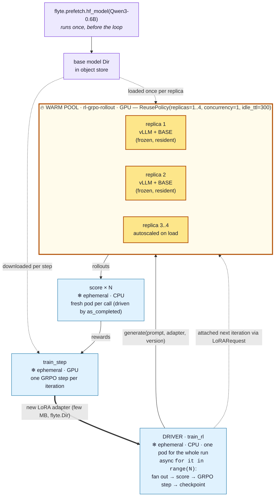

# Reinforcement Learning for LLMs (GRPO + LoRA) on Union

A hands-on tutorial that builds a **reinforcement-learning loop for LLMs** — the same shape used to
train reasoning models — and runs it on Union with `flyte-sdk`. You write ordinary Python functions;
Flyte tasks *are* the orchestrator. No extra cluster or scheduler to stand up.

By the end you'll understand, and have running:

- the **RL-for-LLMs loop** (sample → generate → score → update → repeat) and the **GRPO** objective,
- how to keep a **vLLM engine warm** across iterations so you don't reload the model every step,
- how to train a **LoRA adapter** with a custom policy-gradient step and hand it back to the rollout
  engine,
- how to **pipeline** generation and reward scoring so they overlap,
- and how to make the whole thing **resumable** with a live progress **report**.

The full, runnable code is in [`rl_grpo_lora.py`](./rl_grpo_lora.py); this README explains it
piece by piece. It has been validated end-to-end on a Union demo cluster (Qwen3-0.6B, L4 GPUs).

---

## Why Flyte is a great fit for RL training

RL training loops are awkward to run well: they mix very different kinds of work (GPU generation, CPU
scoring, GPU training), they run for a long time so failures are inevitable, and they're hard to
observe. These are exactly the problems Flyte is built for — which is why the loop in this tutorial is
just a `for` loop of plain functions, with no bespoke infrastructure around it.

- **Right hardware for each step, automatically.** Generation, reward, and training have different
  needs. Each is its own `TaskEnvironment` with its own resources — GPU for rollouts and the trainer,
  cheap CPU for reward and the driver — and Flyte schedules each on the right machine. You're not
  paying for a GPU to run a CPU reward function.
- **Warm pools for expensive engines.** Loading a model into vLLM is slow. A `ReusePolicy`
  environment keeps warm replicas alive between calls, so you load the base **once** and reuse it for
  every iteration — the single most important optimization in an RL-for-LLMs loop, and it's one
  argument.
- **The loop is just Python.** The orchestrator *is* your async driver task. You fan out rollouts with
  `asyncio.create_task`, overlap reward with `as_completed`, and call the trainer — all standard
  Python, but each call runs in its own container, scales independently, and shows up in the UI.
- **Long runs survive failures.** RL runs for hours or days; spot preemptions and OOMs happen.
  `flyte.Checkpoint` resumes the loop mid-run, task `retries` recover transient failures, and the warm
  pool autoscales and recovers without you writing a control plane.
- **Observability out of the box.** Every rollout, reward, and gradient step is a tracked task with
  logs and lineage. `flyte.group` organizes iterations in the DAG, and `report=True` streams a live
  HTML report (reward, accuracy, loss) as training progresses.
- **Data plumbing is handled.** The LoRA adapter flows trainer → generator as a `flyte.io.Dir` output;
  the base model is prefetched into object storage once. No manual file shuffling, no shared
  filesystem to manage.
- **One system, from laptop to multi-node.** The same code runs on one GPU or scales out by changing
  an environment (multi-GPU rollouts, multi-node training) — no second framework, no separate cluster
  to stand up and babysit.

The rest of this tutorial shows each of these in action.

---

## 1. The idea: RL for LLMs in one loop

Reinforcement learning fine-tunes a language model against a **reward** instead of fixed target text.
The loop is always the same shape:

```
   sample prompts
        │
        ▼
   generate several candidate answers per prompt        ← the "policy" (our LLM) acts
        │
        ▼
   score each answer with a reward function             ← how good was it?
        │
        ▼
   nudge the policy toward higher-reward answers         ← the gradient step
        │
        ▼
   repeat with the improved policy
```

### What is GRPO?

**GRPO** (Group Relative Policy Optimization) is the algorithm behind models like DeepSeek-R1. Its one
big idea: to decide whether an answer was "good," compare it to **other answers to the same prompt**,
rather than training a separate value network to predict a baseline (as PPO does).

For each prompt we sample a **group** of `G` answers and compute a *group-relative advantage*:

```
advantage(answer_i) = (reward_i − mean(rewards in group)) / (std(rewards in group) + ε)
```

Answers above their group's average get a positive advantage (make them more likely); answers below
get a negative one (make them less likely). The training objective we maximize is:

```
J(θ) = mean over answers [ advantage_i · (average log-probability the policy assigns to answer_i) ]
```

That's it — no critic, no replay buffer. This tutorial implements that objective directly so you can
see exactly what each line does (see [§5.4](#54-the-grpo-update-train_step)). The full GRPO paper adds
a PPO-style clipped ratio and a KL penalty to a reference model; we omit both to keep the math
legible — valid for the single-gradient-step-per-iteration setup here, and called out in the code.

### Why LoRA?

Updating all of a model's weights every iteration is expensive and makes the weight handoff between
"trainer" and "generator" huge. Instead we freeze the base model and train a small **LoRA adapter** —
a pair of low-rank matrices added on top of the frozen weights. The adapter is only a few **megabytes**,
which is what makes the warm-engine trick below practical: the generator keeps the big frozen base
resident and just swaps in the tiny adapter each iteration.

### Coming from Ray / RLlib?

If you've written RL with Ray, the mental map is direct:

| In Ray/RLlib | Here (Union + flyte-sdk) |
|---|---|
| Rollout worker actors | the **warm vLLM pool** (`generate`) |
| Learner / trainer | the **`train_step`** task |
| Driver / Tune loop | a plain **`async` driver task** (`train_rl`) |
| `ray.remote` calls | calling another `@task` (`await generate(...)`) |

The difference is there's no separate Ray cluster to launch and babysit. Each box is just a Python
function with a decorator; Flyte schedules them, moves data between them, retries them, and shows them
in a UI.

---

## 2. How the work is laid out

The loop is four task environments plus a one-time model prefetch:

| Environment | Hardware | Job |
|---|---|---|
| `generate` (rollout) | GPU, **warm pool** | run vLLM, produce candidate answers with the current adapter |
| `score` (reward) | CPU | grade each answer (rule-based / verifiable) |
| `train_step` (trainer) | GPU | one GRPO step, emit the new LoRA adapter |
| `train_rl` (driver) | CPU | run the `for` loop, wire everything together, checkpoint |

The one thing that's special is the **warm pool**. Loading an 8-billion-parameter (or even a small
0.6B) model into a vLLM engine takes time. If `generate` were a fresh container every call, you'd pay
that cost on every rollout. So `generate` lives in a **reusable** environment: Flyte keeps a small pool
of warm replicas alive between calls, each holding the loaded engine in memory. Everything else is an
ordinary ephemeral pod — cheap to start, and stateless between iterations.

### Warm-pool topology

Only the rollout generator is a warm pool (🔥). The driver, reward, and trainer are ephemeral (❄):



🔥 = warm / reused across iterations (`ReusePolicy`) &nbsp;·&nbsp; ❄ = ephemeral (new container per
call). In the validated run, the `generate` actions ran as Flyte **`actor`** tasks (the warm pool),
while `init_adapter` / `score` / `train_step` ran as ordinary **`python`** pods.

---

## 3. Prerequisites

- A Union/Flyte deployment with **GPU** capacity (the tutorial uses `L4:1`; any single modern GPU works
  for a small model).
- A **Hugging Face token** stored as a Union secret. The example reads a secret named `hf-token`; create
  yours with `flyte create secret hf-token` (or rename `HF_SECRET` in the code to match an existing one).
- `flyte-sdk` configured for your endpoint (`flyte create config ...`).

Run it with:

```bash
python rl_grpo_lora.py
```

The script prefetches the base model, then launches the training loop. The first run also builds the
container image (vLLM + flashinfer + PEFT), which takes a few minutes; later runs reuse it.

---

## 4. The model weights: prefetch once

vLLM (the generator) and Transformers/PEFT (the trainer) both need the base model's weights. Rather
than have every task download from Hugging Face, we **prefetch once** into Union's object store and
pass the resulting directory into the tasks as a `flyte.io.Dir`:

```python
import flyte.prefetch

run = flyte.prefetch.hf_model(repo="Qwen/Qwen3-0.6B", hf_token_key="hf-token")
run.wait()
base_dir = run.outputs()[0]          # the model Dir, passed into train_rl(base=base_dir)
```

> **Note — plain weights, not vLLM-sharded.** `hf_model` can pre-shard for vLLM, but that layout isn't
> readable by the Transformers/PEFT trainer. For a single GPU (`tensor_parallel_size=1`) vLLM loads
> plain Hugging Face weights directly with no downside, so we prefetch plain weights and share one
> directory with both the generator and the trainer. Pre-sharding only pays off for multi-GPU rollout
> replicas, which would then need a separate copy for the trainer.

---

## 5. Walkthrough

### 5.1 Rollouts on a warm vLLM pool (`generate`)

This is the core technique. The environment is marked **reusable** so Flyte keeps warm replicas
between calls, and we hold the engine in a **module-global** so it survives across invocations of the
same replica:

```python
rollout_env = flyte.TaskEnvironment(
    name="rl-grpo-rollout",
    image=image,
    resources=flyte.Resources(cpu=4, memory="24Gi", gpu=flyte.GPU("L4", 1), shm="auto"),
    reusable=flyte.ReusePolicy(replicas=(1, 4), concurrency=1, idle_ttl=300, scaledown_ttl=120),
    secrets=[HF_SECRET],
)

_ENGINE = None             # persists across calls within a warm replica
_ADAPTER_PATHS = {}        # adapter version -> local path (downloaded once)

@rollout_env.task
async def generate(base, question, answer, adapter, version, group_id) -> list[Rollout]:
    global _ENGINE
    from vllm import LLM, SamplingParams
    from vllm.lora.request import LoRARequest

    if _ENGINE is None:                                   # builds ONCE per replica, then stays warm
        local_base = await base.download()
        _ENGINE = LLM(model=local_base, enable_lora=True, max_lora_rank=LORA_RANK, ...)

    if version not in _ADAPTER_PATHS:                     # download each adapter version once
        _ADAPTER_PATHS[version] = await adapter.download()

    lora = LoRARequest(f"policy-v{version}", version + 1, _ADAPTER_PATHS[version])
    sampling = SamplingParams(n=GROUP_SIZE, temperature=1.0, max_tokens=MAX_NEW_TOKENS)
    outputs = await asyncio.to_thread(_ENGINE.generate, [build_prompt(question)], sampling,
                                      lora_request=lora)
    return [Rollout(group_id=group_id, question=question, completion=o.text, answer=answer)
            for o in outputs[0].outputs]
```

Key points:

- **`enable_lora=True`** reserves adapter slots when the engine starts. The frozen base loads once.
- Each call attaches the iteration's adapter with **`LoRARequest(name, id, path)`** — vLLM applies
  `W + (B·A)·scale` on the fly. The base weights in GPU memory are never touched; "swapping weights"
  is just pointing at a new adapter directory with a new id. (`id` must be ≥ 1, hence `version + 1`.)
- One call returns a whole **group** of `GROUP_SIZE` completions for one prompt — exactly the group
  GRPO needs to compute relative advantages.

### 5.2 Reward (`score`)

The reward is a plain CPU task. This tutorial uses a **verifiable** reward — a tiny arithmetic dataset
where we can check the answer exactly — which is the cleanest way to see RL actually working:

```python
@reward_env.task
async def score(rollout: Rollout) -> float:
    reward = 0.0
    if "####" in rollout.completion:          # format bonus: did it follow instructions?
        reward += 0.2
    if _extract_answer(rollout.completion) == rollout.answer:   # correctness
        reward += 1.0
    return reward
```

Verifiable rewards (math, code execution, format checks) are ideal for learning the mechanics. A
model-based reward later is just a second warm vLLM environment scored the same way.

### 5.3 Pipelining generation and reward

Rather than wait for *all* rollouts to finish before scoring (a barrier), we launch every rollout at
once and score each group **the moment it completes**, so reward computation overlaps generation still
in flight:

```python
rollout_futs = [asyncio.create_task(generate(base, q, a, adapter, version, gid))
                for gid, (q, a) in enumerate(prompts)]

rollouts, reward_futs = [], []
for fut in asyncio.as_completed(rollout_futs):    # yields in completion order
    for r in await fut:
        rollouts.append(r)
        reward_futs.append(asyncio.create_task(score(r)))   # score now, others still running

rewards = await asyncio.gather(*reward_futs)      # aligned with rollouts
```

This is ordinary `asyncio` — `create_task` to fan out, `as_completed` to drain, `gather` to collect.
Because each `await generate(...)` / `score(...)` is a Flyte task call, you get this overlap *across
containers* for free.

### 5.4 The GRPO update (`train_step`)

The trainer resumes the previous adapter (frozen base, trainable LoRA), computes group-relative
advantages, takes **one** policy-gradient step, and saves the new adapter:

```python
@train_env.task
async def train_step(base, rollouts, rewards, adapter, version) -> tuple[flyte.io.Dir, float, int]:
    model = PeftModel.from_pretrained(base_model, local_adapter, is_trainable=True)  # resume adapter
    advantages = _group_normalized_advantages(rollouts, rewards)                     # GRPO baseline

    optimizer.zero_grad()
    for rollout, advantage in zip(rollouts, advantages):
        # log-prob the policy assigns to the completion tokens
        seq_log_prob = completion_log_prob(model, rollout)
        loss = -advantage * seq_log_prob                  # push up good answers, down bad ones
        loss.backward()                                   # accumulate across the batch
    optimizer.step()                                      # one GRPO step

    model.save_pretrained(out_dir)                        # writes only the small adapter
    return await flyte.io.Dir.from_local(out_dir), mean_loss, contributing
```

`_group_normalized_advantages` is the GRPO formula from [§1](#what-is-grpo): standardize each reward
against its prompt group. `save_pretrained` on a PEFT model writes only `adapter_config.json` +
`adapter_model.safetensors` (a few MB) — that `Dir` is the entire trainer→generator handoff.

> **Why a custom step instead of a library trainer?** Libraries like TRL's `GRPOTrainer` own the whole
> loop — they generate completions and call the reward function *internally*. That's great for a
> self-contained job, but it would bypass our warm vLLM pool and the as-completed pipelining, which are
> the whole point of running this on Union. Driving one explicit gradient step keeps generation, reward,
> and the update as separate, observable Flyte tasks.

### 5.5 The driver loop (`train_rl`)

The driver is a normal `async` task that owns the `for` loop. Each iteration it fans out rollouts,
scores them, takes a GRPO step, then **checkpoints** loop state and **publishes a report**:

```python
@driver_env.task(report=True)
async def train_rl(base: flyte.io.Dir, num_iterations: int = NUM_ITERATIONS) -> flyte.io.Dir:
    cp = flyte.ctx().checkpoint
    # resume from a previous attempt if one exists ...
    adapter = await init_adapter(base)          # iteration 0 starts from a fresh adapter

    for it in range(start_iter, num_iterations):
        with flyte.group(f"iter-{it}"):         # groups this iteration's tasks in the UI
            rollouts, rewards = ...             # fan out + as_completed (see §5.3)
            adapter, loss, _ = await train_step(base, rollouts, rewards, adapter, it + 1)
            await cp.save(loop_state)           # resumable: survives preemption
            await _publish_report(history, status="running")    # live HTML report
    return adapter
```

Two things worth calling out:

- **`flyte.Checkpoint`** persists `{iteration, adapter location, report history}` each step. If the
  driver is preempted, it resumes mid-run instead of starting over.
- **`flyte.group("iter-N")`** nests each iteration's tasks in the UI so the DAG is readable.

### 5.6 The live report

`report=True` plus [`report_helpers.py`](./report_helpers.py) gives you a self-contained HTML report,
re-published every iteration, showing reward / accuracy / format-rate / loss charts, a per-iteration
table, and the best sample completion. It's pure Python (inline SVG, no plotting dependency) so the
CPU driver stays light. Open it from the run's **Report** tab in the Union UI.

---

## 6. What this validates

Running `python rl_grpo_lora.py` against a Union demo cluster (Qwen3-0.6B, L4 GPUs, 3 GRPO iterations)
exercises the whole loop:

- prefetch → `init_adapter` → **12 warm-vLLM rollouts** → **72 pipelined reward tasks** →
  **3 GRPO steps** → final LoRA adapter (`v3`) returned as a `flyte.io.Dir`,
- with the live report published each iteration, the driver checkpointing per step, and the rollout
  tasks running as warm **`actor`** replicas.

(With a 0.6B model and a toy dataset this proves the *machinery*, not convergence — scale the model and
dataset for a real learning signal.)

---

## 7. Going further

The example is intentionally the smallest thing that runs end to end. Natural next steps:

- **A real task & bigger policy.** Swap `BASE_MODEL_REPO` and `DATASET` for a larger model and a real
  verifiable-reward dataset (math, code, tool use). The code is unchanged.
- **Model-based reward.** Replace the rule in `score` with a call to a second warm vLLM environment
  (e.g. an LLM judge) — same warm-pool pattern as the generator.
- **Multi-GPU rollouts.** Raise `tensor_parallel_size` and prefetch a vLLM-sharded copy for the
  generator (keeping a plain copy for the trainer).
- **Multi-node training.** When the policy outgrows one GPU, move `train_step` to a
  `ClusteredTaskEnvironment` with `TorchRun`; the body stays nearly the same.
- **Full-weight RL.** If LoRA capacity isn't enough, train all parameters and hand off the full model
  directory instead of an adapter.
- **Serving the result.** Merge the final adapter into the base (`merge_and_unload()`) and serve it
  with `VLLMAppEnvironment`.
- **The full GRPO objective.** Add the PPO-style clipped ratio and a KL penalty to a reference model
  for stability over many steps.

---

## 8. Files & references

- [`rl_grpo_lora.py`](./rl_grpo_lora.py) — the full example: prefetch, warm-vLLM rollouts, reward,
  GRPO `train_step`, and the async driver loop.
- [`report_helpers.py`](./report_helpers.py) — dependency-free HTML/SVG report toolkit.

Patterns this tutorial builds on, from the flyte-sdk examples:

- `examples/genai/vllm/vllm_app.py` — the `flyte.prefetch.hf_model` + vLLM image recipe.
- `examples/streaming/basic_as_completed.py` — the reusable-env + `as_completed` pipelining pattern.
- `examples/checkpoint/unsloth_sft_checkpoint.py` — TRL/PEFT LoRA + `flyte.Checkpoint`.

---

Everything here — warm GPU pools, CPU reward fan-out, a resumable driver loop, live reporting — is
plain `flyte-sdk`. That's the takeaway: an RL training loop, which usually means standing up and
operating a distributed system, becomes a handful of decorated Python functions on Flyte. Start with
this small example, then scale the model, the reward, and the hardware without changing the shape of
your code.
